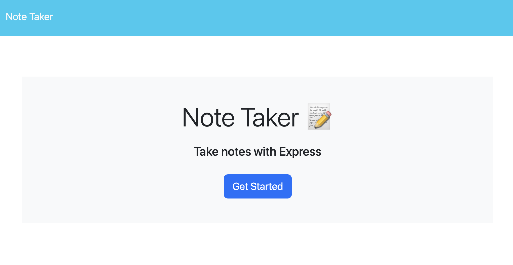
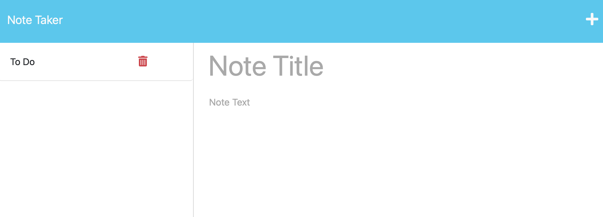

# Note Taker

## Description
The creation of this application is for the user to be able to write and save notes to keep track of any thoughts or tasks they need to complete. This application makes it easier for any user to manage their notes all in one place instead of having sticky notes all over the place. One thing I learned while working on this application was using uuuidv4 to create a unique id for each note when it is saved. 

## Installation
Project Repository on GitHub: https://github.com/renrojas/note-taker
Heroku: https://glacial-sea-23660-045a64e39b85.herokuapp.com/

## Usage

To navigate this application, you will start by clicking on the 'Get Started' button on the middle of the page.

From here you can access any old notes you have saved, they will be on the left column.

To add a note, you can click on the '+' button on the top right and fill out the grayed out fields to add a note title and and note text. Once finished click on the white floppy disk on the top right of the page to save the note. 

## Credits

https://www.npmjs.com/package/uuidv4 - UUUidv4

https://expressjs.com/en/guide/writing-middleware.html - Express.js

https://expressjs.com/en/guide/routing.html - Routing Express.js

https://coding-boot-camp.github.io/full-stack/heroku/how-to-install-the-heroku-cli - Installing Heroku CLI

https://coding-boot-camp.github.io/full-stack/heroku/heroku-deployment-guide - Heroku Deployment

## License
MIT License

Copyright (c) 2023 renrojas

Permission is hereby granted, free of charge, to any person obtaining a copy
of this software and associated documentation files (the "Software"), to deal
in the Software without restriction, including without limitation the rights
to use, copy, modify, merge, publish, distribute, sublicense, and/or sell
copies of the Software, and to permit persons to whom the Software is
furnished to do so, subject to the following conditions:

The above copyright notice and this permission notice shall be included in all
copies or substantial portions of the Software.

THE SOFTWARE IS PROVIDED "AS IS", WITHOUT WARRANTY OF ANY KIND, EXPRESS OR
IMPLIED, INCLUDING BUT NOT LIMITED TO THE WARRANTIES OF MERCHANTABILITY,
FITNESS FOR A PARTICULAR PURPOSE AND NONINFRINGEMENT. IN NO EVENT SHALL THE
AUTHORS OR COPYRIGHT HOLDERS BE LIABLE FOR ANY CLAIM, DAMAGES OR OTHER
LIABILITY, WHETHER IN AN ACTION OF CONTRACT, TORT OR OTHERWISE, ARISING FROM,
OUT OF OR IN CONNECTION WITH THE SOFTWARE OR THE USE OR OTHER DEALINGS IN THE
SOFTWARE.

## How to Contribute
To contribute, please contact https://github.com/renrojas

## Questions
https://github.com/renrojas

Please email me at <karensadithrojas@gmail.com> for any additional questions.